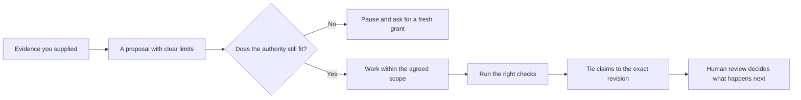

# Local Assistant Reliability Lab

Start here for public, runnable examples of practical harnesses for reliable,
human-accountable AI work.

This is an overview repo, not a platform. EvidenceGate is the flagship pattern
for leaving a revision-bound, human-reviewed receipt, while the wider toolkit
explores small models, coding-agent boundaries, structured output, context,
action authority, repeatable QA, and public-safe publishing.

**Not a coder?** Start with the [Agent Operator Handbook](https://github.com/TheDarkniteFalls/agent-operator-handbook).
It shows how to point an agent at the current source of truth, set a few stop
signs, review evidence without reading code, and carry one tested lesson into
the next task.

## See It All Come Together

If you would like to see the ideas working together before exploring each
project, start here:

```sh
python3 -B run_complete_workflow.py
```

This friendly, self-contained demo creates a tiny fictional Git repository and
walks one small fix all the way through: reading the supplied sources, checking
the authority grant, rejecting unsafe writes and grant replay, asking again
when the scope changes, running a focused regression check, and leaving a
replayable receipt bundle. It calls no model or network service, and it tidies
up the temporary files when it is done.

At the end, you should see:

```text
PASS replayable_bundle
PASS complete_workflow
```

Curious about what the demo produced? Keep a copy of the synthetic repository,
trace, receipt, manifest, and static report outside your checkout, then replay
it whenever you like:

```sh
python3 -B run_complete_workflow.py --output-dir /tmp/reliable-agent-workflow
python3 -B run_complete_workflow.py --replay /tmp/reliable-agent-workflow
```

The receipt follows the EvidenceGate v1 shape. The Lab replay intentionally
checks only the relationships used in this demonstration; for real repository
verification, bring in the full
[EvidenceGate](https://github.com/TheDarkniteFalls/evidencegate) validator.

If you already have EvidenceGate installed, you can also run its full local
repository check against the retained receipt:

```sh
evidencegate verify /tmp/reliable-agent-workflow/evidencegate-receipt.json \
  --repo /tmp/reliable-agent-workflow/synthetic-repo --format json
```

If you would prefer a slower, guided tour, the longer
[review walkthrough](REVIEWING_AN_AI_ASSISTED_CHANGE.md) explains what every
toolkit component proves and what it deliberately leaves open.

## Start With The Problem You Want To Solve

| If this is getting in your way... | Start here | What you will see |
| --- | --- | --- |
| An agent exceeds the authority it was given | `python3 -B run_complete_workflow.py` | Protected writes, grant replay, and changed scope are rejected |
| A receipt describes the wrong revision or evidence | `python3 -B examples/run-v1-reference.py` in EvidenceGate | Stale heads, omitted paths, and protected paths fail |
| An answer escapes the supplied evidence | `python3 context_boundary_check.py --self-test` in Context Boundary Examples | Unsupported answers and missing citations fail |



## Start Here

- Begin with the [Agent Operator Handbook](https://github.com/TheDarkniteFalls/agent-operator-handbook)
  if you mostly want the agent to do the work and need a plain-language way to
  stay in control.
- Start with [EvidenceGate](https://github.com/TheDarkniteFalls/evidencegate)
  for the core idea and its one-command detached v1 reference run.
- Choose a repository from the problem-based table below when you need a
  specific runnable pattern.
- Use the 15-minute walkthrough and command matrix for a quick tour of the
  complete toolkit.

## Latest Lessons

- [AI-assisted work should leave a revision-bound, reviewable receipt](https://github.com/TheDarkniteFalls/evidencegate),
  not just a chat history or an ungrounded summary.
- [A model may suggest an action without owning the authority to execute it](https://github.com/TheDarkniteFalls/agent-action-authority-examples).
- [Reliable harnesses validate model output before trusting or applying it](https://github.com/TheDarkniteFalls/local-model-reliability-example).

## Which Repo Should I Use?

| If you need to... | Start with |
| --- | --- |
| Check a repo before making it public | [Public Repo Safety Kit](https://github.com/TheDarkniteFalls/public-repo-safety-kit) |
| Give a coding agent project rules | [Codex Project Instructions Starter](https://github.com/TheDarkniteFalls/codex-project-instructions-starter) |
| Leave a reviewable receipt for AI-assisted work | [EvidenceGate](https://github.com/TheDarkniteFalls/evidencegate) |
| Validate structured local-model output | [Local Model Reliability Example](https://github.com/TheDarkniteFalls/local-model-reliability-example) |
| Check that answers stay inside supplied evidence | [Context Boundary Examples](https://github.com/TheDarkniteFalls/context-boundary-examples) |
| Classify agent actions before execution | [Agent Action Authority Examples](https://github.com/TheDarkniteFalls/agent-action-authority-examples) |
| Keep one important workflow obviously healthy | [Green-Spine QA Pattern](https://github.com/TheDarkniteFalls/green-spine-qa-pattern) |

## 15-Minute Walkthrough

1. Spend 2 minutes with Public Repo Safety Kit to see the public/private gate.
2. Spend 2 minutes with Codex Project Instructions Starter to see the repo rules.
3. Spend 2 minutes with EvidenceGate to run a detached v1 receipt against real
   temporary Git revisions.
4. Spend 3 minutes with Local Model Reliability Example to see validation before trust.
5. Spend 2 minutes with Context Boundary Examples to see evidence-only answers.
6. Spend 2 minutes with Agent Action Authority Examples to see action classification.
7. Spend 2 minutes with Green-Spine QA Pattern to see one compact health check.

## Command Matrix

| Repo | Runnable check |
| --- | --- |
| Public Repo Safety Kit | `python3 public_repo_guard.py --self-test` |
| Codex Project Instructions Starter | `python3 check_templates.py` |
| EvidenceGate | `python3 -B examples/run-v1-reference.py` |
| Local Model Reliability Example | `python3 reliability_demo.py --self-test` |
| Context Boundary Examples | `python3 context_boundary_check.py --self-test` |
| Agent Action Authority Examples | `python3 action_authority_check.py --self-test` |
| Green-Spine QA Pattern | `python3 spine_green.py` |

## Toolkit Index

This repo keeps the navigation data in `toolkit_index.json` and validates it
with:

```sh
python3 check_toolkit_index.py
```

Expected result:

```text
PASS toolkit_index
PASS complete_workflow_entry
PASS required_repos
PASS evidencegate_v1_reference
PASS public_safe_text
```

## Public/Private Boundary

All examples linked here use synthetic data. Do not add private assistant logs,
connector exports, credentials, local machine paths, personal notes, or real
customer/user data to these public repos.

## Scope

This lab is a visitor-facing map. Each linked repo owns its own runnable example.
If this README gets too long, move the tables into a separate `TOOLKIT_MAP.md`
instead of turning this repo into a framework.

## Quality Checks

```sh
python3 check_toolkit_index.py
python3 -B run_complete_workflow.py --self-test
python3 -m py_compile check_toolkit_index.py run_complete_workflow.py
```
