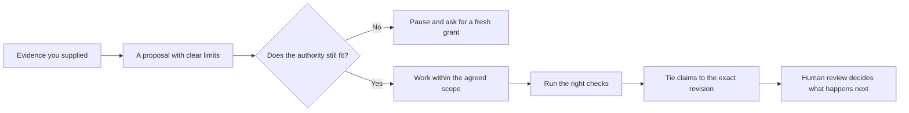

# Local Assistant Reliability Lab

Start here for public, runnable examples of practical harnesses for reliable,
human-accountable AI work.

**Choose in two minutes:** use the
[Toolkit Navigator](https://thedarknitefalls.github.io/local-assistant-reliability-lab/)
for one recommendation, or scan the [complete toolkit map](TOOLKIT_MAP.md) when
you want all 14 public contracts at once.
Agents and tools can read the same catalog from the
[machine-readable toolkit index](toolkit_index.json).

This is an overview repo, not a platform. EvidenceGate is the flagship pattern
for leaving a revision-bound, human-reviewed receipt, while the wider toolkit
explores small models, coding-agent boundaries, structured output, context,
action authority, repeatable QA, and public-safe publishing.

**Not a coder?** [Create a private Reliable AI Work Starter](https://github.com/new?template_owner=TheDarkniteFalls&template_name=reliable-ai-work-starter&visibility=private),
or read the [Agent Operator Handbook](https://github.com/TheDarkniteFalls/agent-operator-handbook)
first. Both keep important state outside chat and consequential actions behind
clear approval boundaries.

## See It All Come Together

If you would like to see the ideas working together before exploring each
project, start here:

```sh
python3 -B run_complete_workflow.py
```

This friendly, self-contained demo creates a tiny fictional Git repository and
walks one small fix all the way through: reading the supplied sources, checking
the authority grant, rejecting unsafe writes and grant replay, asking again
when the scope changes, running a focused regression check, and leaving a
replayable receipt bundle. It calls no model or network service, and it tidies
up the temporary files when it is done.

At the end, you should see:

```text
PASS replayable_bundle
PASS complete_workflow
```

Curious about what the demo produced? Keep a copy of the synthetic repository,
trace, receipt, manifest, and static report outside your checkout, then replay
it whenever you like:

```sh
python3 -B run_complete_workflow.py --output-dir /tmp/reliable-agent-workflow
python3 -B run_complete_workflow.py --replay /tmp/reliable-agent-workflow
```

The receipt follows the EvidenceGate v1 shape. The Lab replay intentionally
checks only the relationships used in this demonstration; for real repository
verification, bring in the full
[EvidenceGate](https://github.com/TheDarkniteFalls/evidencegate) validator.

If you already have EvidenceGate installed, you can also run its full local
repository check against the retained receipt:

```sh
evidencegate verify /tmp/reliable-agent-workflow/evidencegate-receipt.json \
  --repo /tmp/reliable-agent-workflow/synthetic-repo --format json
```

If you would prefer a slower, guided tour, the longer
[review walkthrough](REVIEWING_AN_AI_ASSISTED_CHANGE.md) explains what every
toolkit component proves and what it deliberately leaves open.

## Start With The Problem You Want To Solve

| If this is getting in your way... | Start here | What you will see |
| --- | --- | --- |
| You want one useful private workflow without building an app | [Reliable AI Work Starter](https://github.com/TheDarkniteFalls/reliable-ai-work-starter) | Named sources, bounded authority, durable state, review evidence, and a clean handoff |
| You want to build with Codex without becoming a developer first | [Agent Operator Handbook](https://github.com/TheDarkniteFalls/agent-operator-handbook) | A Project Card, approval ladder, verification guide, and plain-English operating method |
| An agent exceeds the authority it was given | `python3 -B run_complete_workflow.py` | Protected writes, grant replay, and changed scope are rejected |
| A receipt describes the wrong revision or evidence | `python3 -B examples/run-v1-reference.py` in EvidenceGate | Stale heads, omitted paths, and protected paths fail |
| An answer escapes the supplied evidence | `python3 context_boundary_check.py --self-test` in Context Boundary Examples | Unsupported answers and missing citations fail |
| An agent may continue from illegal or stale context | `python3 -B context_compiler.py check` in Context Contract Compiler | Required records, explicit exclusions, fail-closed obligations, and stale receipts are checked deterministically |
| Generated content is stale, disconnected, or impossible to traverse | `python3 -B generated_system_qa.py --self-test` in Generated-System QA Pattern | Freshness, integrity, reachability, required services, and a representative journey are checked |
| A scarce holdout may have leaked into generation or review | `python3 -B sealed_eval.py --self-test` in Sealed Evaluation Pattern | Access order, frozen outputs, digests, and retirement of revealed material are checked |
| Model comparisons mix different kinds of work | `python3 -B model_workload_telemetry.py --self-test` in Model Workload Telemetry | Only shared task instances are compared inside each workload class |
| AI-assisted game changes can violate the legal flow | `npm test` in AI Game State Machine Pattern | Illegal actions, read-only inspection, save/restore obligations, and deterministic replay are checked |



## Start Here

- Use the [Toolkit Navigator](https://thedarknitefalls.github.io/local-assistant-reliability-lab/)
  when you want one recommendation based on your goal, experience, runtime,
  and operating constraints.
- Begin with the [Agent Operator Handbook](https://github.com/TheDarkniteFalls/agent-operator-handbook)
  if you mostly want the agent to do the work and need a plain-language way to
  stay in control.
- Start with [EvidenceGate](https://github.com/TheDarkniteFalls/evidencegate)
  for the core idea and its one-command detached v1 reference run.
- Choose a repository from the problem-based table below when you need a
  specific runnable pattern.
- Use the 15-minute walkthrough and command matrix for a quick tour of the
  complete toolkit.

## Latest Lessons

- [AI-assisted work should leave a revision-bound, reviewable receipt](https://github.com/TheDarkniteFalls/evidencegate),
  not just a chat history or an ungrounded summary.
- [A model may suggest an action without owning the authority to execute it](https://github.com/TheDarkniteFalls/agent-action-authority-examples).
- [Reliable harnesses validate model output before trusting or applying it](https://github.com/TheDarkniteFalls/local-model-reliability-example).

## Complete Toolkit Map

The [complete public toolkit map](TOOLKIT_MAP.md) groups every current guide,
tool, and runnable pattern into three visitor journeys:

| Journey | Start here when you need to... |
| --- | --- |
| **Start and direct** | Describe the outcome, name trusted sources, and set authority and handoff rules |
| **Bound and prove** | Keep work inside evidence and action boundaries, then leave inspectable proof |
| **Evaluate and operate** | Test retrieval, generated systems, evaluation protocols, model workloads, or deterministic state |

The map makes the maturity, intended audience, first command, proof boundary,
limitation, and CI workflow visible for every entry. It is generated from
`toolkit_index.json`, so the public catalog and its validation use one source
of truth.

## Core 15-Minute Walkthrough

1. Spend 2 minutes with Public Repo Safety Kit to see the public/private gate.
2. Spend 2 minutes with Codex Project Instructions Starter to see the repo rules.
3. Spend 2 minutes with EvidenceGate to run a detached v1 receipt against real
   temporary Git revisions.
4. Spend 3 minutes with Local Model Reliability Example to see validation before trust.
5. Spend 2 minutes with Context Boundary Examples to see evidence-only answers.
6. Spend 2 minutes with Agent Action Authority Examples to see action classification.
7. Spend 2 minutes with Green-Spine QA Pattern to see one compact health check.

## Core Command Matrix

| Repo | Runnable check |
| --- | --- |
| Public Repo Safety Kit | `python3 public_repo_guard.py --self-test` |
| Codex Project Instructions Starter | `python3 check_templates.py` |
| EvidenceGate | `python3 -B examples/run-v1-reference.py` |
| Local Model Reliability Example | `python3 reliability_demo.py --self-test` |
| Context Boundary Examples | `python3 context_boundary_check.py --self-test` |
| Agent Action Authority Examples | `python3 action_authority_check.py --self-test` |
| Green-Spine QA Pattern | `python3 spine_green.py` |

## Toolkit Index

This repo keeps the navigation data in `toolkit_index.json` and validates it
with:

```sh
python3 check_toolkit_index.py
```

Expected result:

```text
PASS toolkit_index
PASS complete_workflow_entry
PASS required_repos
PASS first_party_repository_links
PASS visitor_journeys
PASS trust_signals
PASS evidencegate_v1_reference
PASS public_safe_text
PASS toolkit_map
PASS navigator_data
PASS navigator_ranking
PASS navigator_structure
PASS navigator_accessibility
PASS navigator_responsive
PASS navigator_failure_path
```

## Public/Private Boundary

All examples linked here use synthetic data. Do not add private assistant logs,
connector exports, credentials, local machine paths, personal notes, or real
customer/user data to these public repos.

## Scope

This lab is a visitor-facing map and static Navigator. Each linked repo owns
its own runnable example. `toolkit_index.json` remains the only catalog source;
the Markdown map and browser data are generated from it instead of becoming
separate stores.

## Quality Checks

```sh
python3 check_toolkit_index.py
python3 render_toolkit_map.py --check
python3 render_navigator.py --check
python3 check_navigator.py
node tests/test_navigator.mjs
python3 -B run_complete_workflow.py --self-test
python3 -m py_compile check_toolkit_index.py check_navigator.py render_toolkit_map.py render_navigator.py toolkit_contract.py run_complete_workflow.py
```
